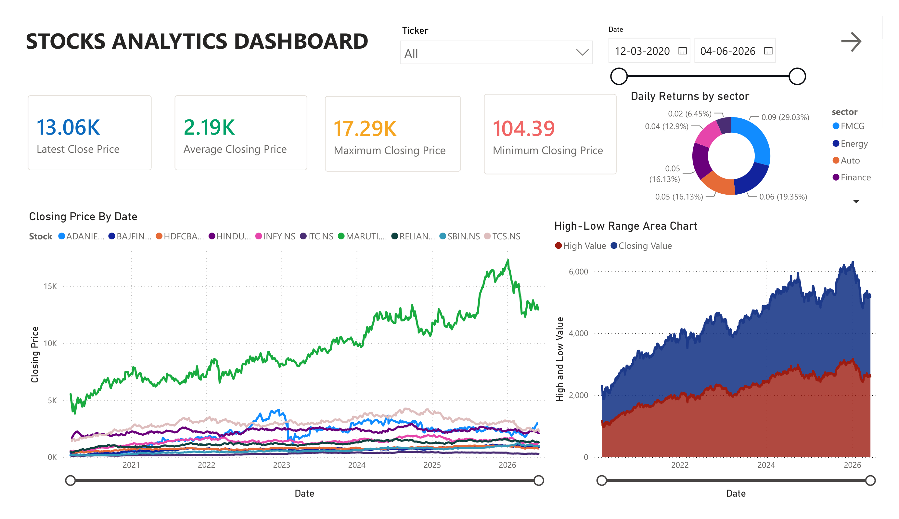
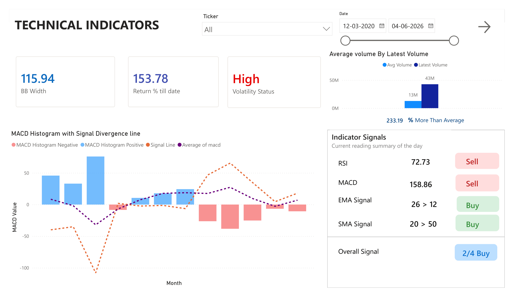
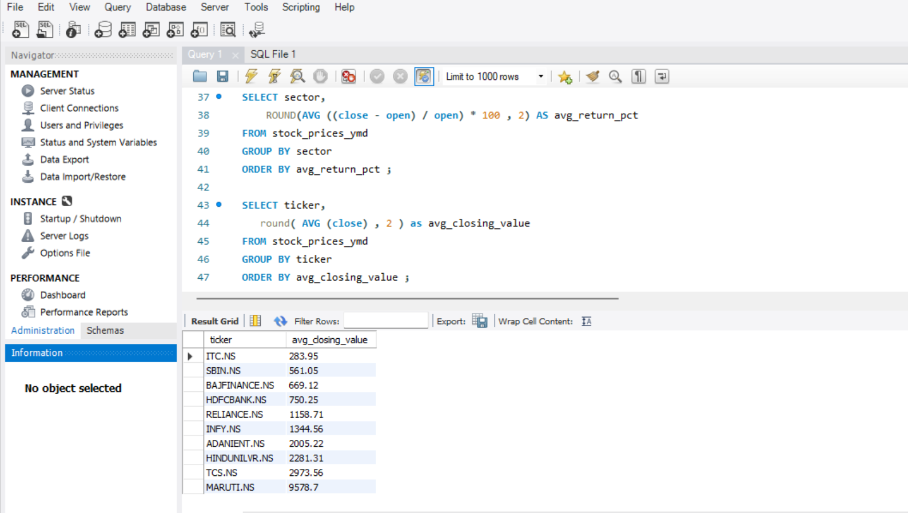

# Stock Market Analytics Dashboard

A stock analytics project covering 10 NSE Listed stocks across FMCG, Energy, Auto, Banking, Finance, and IT — built with Python, SQL, and Power BI.

**Live Dashboard:** [View on Power BI]([YOUR_POWERBI_LINK_HERE](https://app.powerbi.com/view?r=eyJrIjoiNmQ0ZWU2YzMtMjFjNi00NGY4LWE3OWMtMmFmYjNkNWIwNjc2IiwidCI6Ijg0Yjg5MWVhLTM4ZjMtNGRhMy1hMmNhLTE1ODA3MjEwZTc4NCJ9))

## About

We have pulled six years of daily price data (1 Jan 2020 – 4 June 2026) for 10 stocks — Adani Enterprises, Bajaj Finance, HDFC Bank, Hindustan Unilever, Infosys, ITC, Maruti Suzuki, Reliance, SBI, and TCS — using the yfinance API in Google Colab using python, cleaned using pandas and queried with SQL, and built a 3-page interactive Power BI report on top of it.

## Tech stack

- **Python (Google Colab)** — yfinance for Data extraction, Pandas for Data cleaning
- **SQL** — Querying, Aggregation, Calculated metrics
- **Power BI** — Dashboarding, DAX measures, Interactive filtering by ticker and date range

## The 3 pages

**1. Stocks Analytics Dashboard** — Overview of Latest, Maximum, Minimum and Average closing prices across all 10 stocks, daily returns split by sector, and a high-low range area

**2. Technical Indicators** — RSI (Relative Strength Index) , MACD (Moving Average Converge Divergence) histogram with signal divergence line, Bollinger Band width, and volume vs. average, rolled up into an overall Buy/Sell read.

**3. Market Pulse** — Per-stock scorecard that blends MACD, RSI, Bollinger Band position, volume, and upside into one composite score out of 10, plus yearly return history and best/worst single-day moves.

## Key Findings

1. **Maruti Suzuki** was the clear outlier of the group, climbing from roughly ₹5K to highs above ₹17K over the period, while most of the other 9 stocks stayed in a much tighter price band.

2. **Bajaj Finance** posted strong yearly returns in several of the last 6 years (+42% in 2020, +43% in 2025) — good historical returns.

3. Return till date sits at 153.78% over the full window, meaning an investment made on day one would have grown by roughly 2.5x, even accounting for the pullback visible toward the most recent dates.
   
4. On the indicator page, RSI (Relative Strength Index) was reading 72.73 (overbought, so a Sell) at the same time the EMA and SMA crossovers were both flashing Buy — a fairly common mixed-signal moment that the dashboard shows plainly instead of forcing it into one verdict.

## Files in this repo

- `stock_data.ipynb` — data import from yfinance
- `stocks_queries.sql` — Analysis Queries
- `stocks_dashboard.pbix` — Power BI dashboard file
